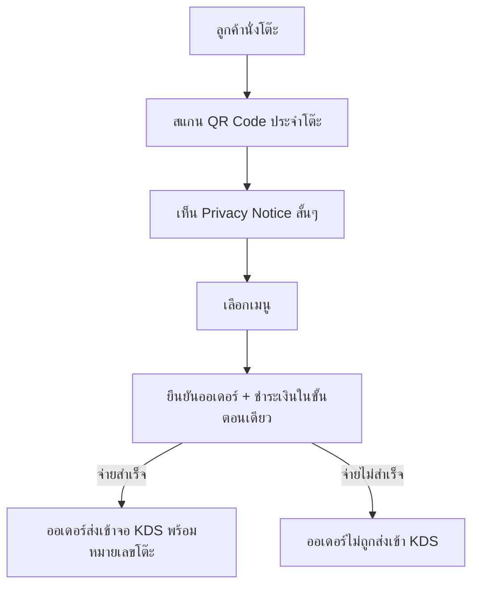
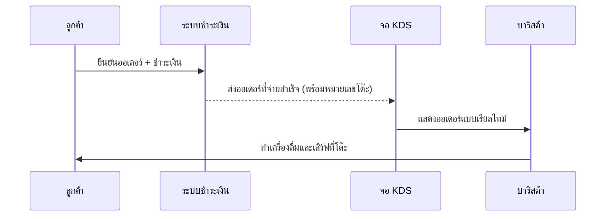
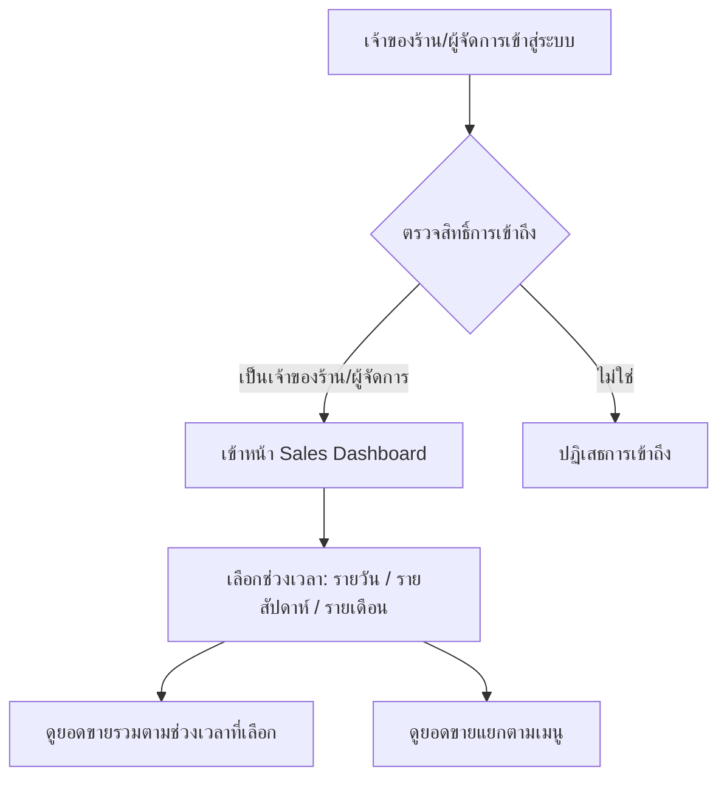
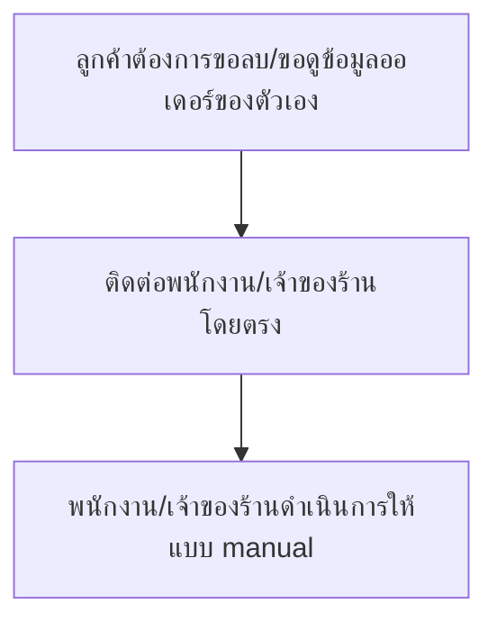

# User Journey

User journey หลักของระบบ ต่อยอดจากลำดับความสำคัญใน
[[../../01-requirements/02-plan/feature-list|feature-list]] แต่ละขั้นตอนใน diagram
แม็ปกลับไปยัง requirement ที่เกี่ยวข้องใน
[[../../01-requirements/01-spec/index|01-spec]]

## ลูกค้าสั่งกาแฟที่โต๊ะด้วย QR Code (ลูกค้า)

| ขั้นตอน | คำอธิบาย | Requirement ที่เกี่ยวข้อง |
|---------|----------|----------------------------|
| A | ลูกค้านั่งโต๊ะที่ติด QR code อยู่ ยังไม่ต้องไปเข้าคิวที่เคาน์เตอร์ | [[../../01-requirements/01-spec/20260802-001-dine-in-qr-table-ordering|QR Table Ordering]] — บริบท/ที่มา |
| B | สแกน QR เฉพาะของโต๊ะนั้นๆ เพื่อเข้าสู่หน้าสั่งอาหารที่ระบุหมายเลขโต๊ะถูกต้อง | [[../../01-requirements/01-spec/20260802-001-dine-in-qr-table-ordering|QR Table Ordering]] — เกณฑ์การยอมรับข้อ 1, กฎ "วิธีสั่ง" |
| C | เห็นประกาศความเป็นส่วนตัวสั้นๆ ก่อนสั่ง/จ่ายเงิน ระบุข้อมูลที่เก็บและวัตถุประสงค์ | [[../../01-requirements/01-spec/20260802-003-log-retention-pdpa-compliance|Log Retention/PDPA]] — เกณฑ์การยอมรับข้อ 1, กฎ "Privacy notice" |
| D | เลือกเมนูที่ต้องการสั่ง | [[../../01-requirements/01-spec/20260802-001-dine-in-qr-table-ordering|QR Table Ordering]] — ขอบเขต (In scope) |
| E | ยืนยันออเดอร์และชำระเงิน (เช่น QR พร้อมเพย์) ในขั้นตอนต่อเนื่องเดียวกัน | [[../../01-requirements/01-spec/20260802-001-dine-in-qr-table-ordering|QR Table Ordering]] — เกณฑ์การยอมรับข้อ 2 |
| F | จ่ายเงินสำเร็จแล้วเท่านั้นออเดอร์จึงขึ้นจอ KDS แบบเรียลไทม์ พร้อมหมายเลขโต๊ะ | [[../../01-requirements/01-spec/20260802-001-dine-in-qr-table-ordering|QR Table Ordering]] — เกณฑ์การยอมรับข้อ 3-4, กฎ "การชำระเงิน"/"การแจ้งครัว" |
| G | ออเดอร์ที่ยังไม่จ่ายเงินต้องไม่ปรากฏบนจอครัว | [[../../01-requirements/01-spec/20260802-001-dine-in-qr-table-ordering|QR Table Ordering]] — กฎ "การชำระเงิน" |

> ⚠️ **ช่องว่างที่พบ**: สเปคยืนยันว่าออเดอร์ที่จ่ายไม่สำเร็จจะไม่เข้า KDS แต่ไม่ได้ระบุ UX
> ฝั่งลูกค้าหลังจ่ายไม่สำเร็จ (เช่น ข้อความแจ้งเตือน / ให้ลองจ่ายใหม่กี่ครั้ง) — ควรชี้แจงเพิ่มเติมกับ
> เจ้าของร้านก่อนนำ diagram นี้ไปออกแบบหน้าจอจริง

## บาริสต้ารับออเดอร์ผ่าน KDS (บาริสต้า)

| ขั้นตอน | คำอธิบาย | Requirement ที่เกี่ยวข้อง |
|---------|----------|----------------------------|
| C→P | ลูกค้ายืนยันออเดอร์และจ่ายเงินสำเร็จก่อนเข้าคิวครัว | [[../../01-requirements/01-spec/20260802-001-dine-in-qr-table-ordering|QR Table Ordering]] — เกณฑ์การยอมรับข้อ 3 |
| P→K | ออเดอร์ที่จ่ายสำเร็จปรากฏบนจอ KDS แบบเรียลไทม์ พร้อมหมายเลขโต๊ะและรายการอาหาร | [[../../01-requirements/01-spec/20260802-001-dine-in-qr-table-ordering|QR Table Ordering]] — เกณฑ์การยอมรับข้อ 4, กฎ "การแจ้งครัว" |
| K→B | บาริสต้าเห็นออเดอร์ทันทีเพื่อทำเครื่องดื่มถูกต้องตามโต๊ะ | [[../../01-requirements/01-spec/20260802-001-dine-in-qr-table-ordering|QR Table Ordering]] — User Story บาริสต้า |
| B→C | เสิร์ฟเครื่องดื่มถูกโต๊ะตามหมายเลขที่ระบุ | [[../../01-requirements/01-spec/20260802-001-dine-in-qr-table-ordering|QR Table Ordering]] — User Story บาริสต้า (ยังไม่มีเกณฑ์การยอมรับแยกสำหรับขั้นตอนเสิร์ฟ) |

## เจ้าของร้าน/ผู้จัดการดู Sales Dashboard (เจ้าของร้าน/ผู้จัดการ)

| ขั้นตอน | คำอธิบาย | Requirement ที่เกี่ยวข้อง |
|---------|----------|----------------------------|
| A-D | เข้าถึง dashboard ได้เฉพาะบัญชีเจ้าของร้าน/ผู้จัดการ บัญชีอื่นเข้าไม่ได้ | [[../../01-requirements/01-spec/20260802-002-sales-dashboard|Sales Dashboard]] — เกณฑ์การยอมรับข้อ 1, กฎ "สิทธิ์การเข้าถึง" |
| E | เลือกช่วงเวลาได้เฉพาะรายวัน/รายสัปดาห์/รายเดือน (ยังไม่มี custom date range) | [[../../01-requirements/01-spec/20260802-002-sales-dashboard|Sales Dashboard]] — เกณฑ์การยอมรับข้อ 2, กฎ "ช่วงเวลาที่ดูได้" |
| F | ดูยอดขายรวมตามช่วงเวลาที่เลือก | [[../../01-requirements/01-spec/20260802-002-sales-dashboard|Sales Dashboard]] — กฎ "มุมมองข้อมูล" (มุมมองที่ 1) |
| G | ดูยอดขายแยกตามเมนู เพื่อรู้ว่าเมนูไหนขายดี/ขายน้อย | [[../../01-requirements/01-spec/20260802-002-sales-dashboard|Sales Dashboard]] — เกณฑ์การยอมรับข้อ 3, กฎ "มุมมองข้อมูล" (มุมมองที่ 2) |

## ลูกค้าขอใช้สิทธิ์ข้อมูลส่วนบุคคล (PDPA) (ลูกค้า)

| ขั้นตอน | คำอธิบาย | Requirement ที่เกี่ยวข้อง |
|---------|----------|----------------------------|
| A-C | ไม่มีฟีเจอร์ self-service ในระบบ ลูกค้าต้องติดต่อพนักงาน/เจ้าของร้านโดยตรงเพื่อขอใช้สิทธิ์ | [[../../01-requirements/01-spec/20260802-003-log-retention-pdpa-compliance|Log Retention/PDPA]] — เกณฑ์การยอมรับข้อ 3, กฎ "สิทธิ์ของเจ้าของข้อมูล" |

## ยังไม่ทำ Journey เต็มรูปแบบ

- ไม่มี — ฟีเจอร์ทั้ง 3 รายการใน [[../../01-requirements/02-plan/feature-list|feature-list]] เป็น Must have/Should have ทั้งหมด จึงมี journey ครบทุกฟีเจอร์ในเวอร์ชันนี้
